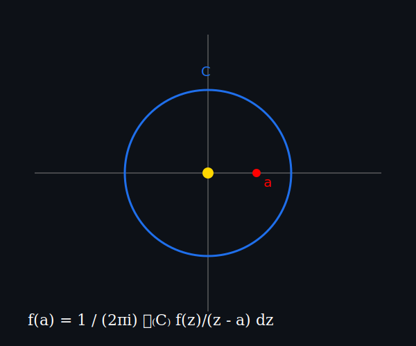

# 👋 José Rodolfo

## 📐 Matemático en proceso

Estudiante de Matemáticas Aplicadas  
Apasionado por el análisis complejo y los algoritmos.

---

## 🌊 Integral de Cauchy

---

f(a) = 1 / (2πi) ∮₍C₎ f(z)/(z - a) dz
